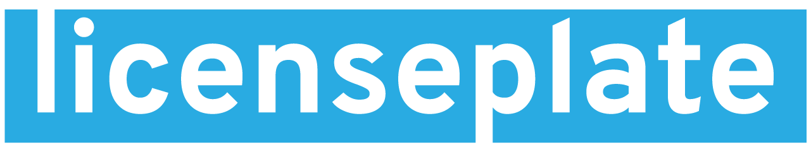

<p align="center">

</p>

<p align="center">  
A browser extension to help you detect unpermissive licenses.
</p>

## Documentation

- [About](https://miweiss.github.io/licenseplate/)
- [Installation](https://miweiss.github.io/licenseplate/installation)
- Features (
[Repository Alertbar](https://miweiss.github.io/licenseplate/features-gh/repo-view/),
[Enhanced Pins](https://miweiss.github.io/licenseplate/features-gh/profile-view/),
[Request Missing License](https://miweiss.github.io/licenseplate/features-gh/request-license/)
)
- [Development](https://miweiss.github.io/licenseplate/development/)
- [Thanks](https://miweiss.github.io/licenseplate/thanks/)
- [Legal Stuff](https://miweiss.github.io/licenseplate/legal/)


## Details for Contributors

Some high level info is given [here](https://miweiss.github.io/licenseplate/development/).

Develop using `npm run watch` and by adding / refreshing the `dist` folder as unpacked extension in the developer mode of `chrome://extension` (or similar on edge / firefox).

### Project Structure

The following are the most relevant folders in this repository. Folders not listed here are hopefully self-explanatory.

```
.
├── public                  # Static resources
├── browser_control         # E2E tests and automated image generation for docs. Uses python & selenium
├── dist                    # The extension (built using `npm run build`) ends up here.
├── src                     # Source Files 
│   ├── __codegen__         # Code for static license info generation (run `npm run gen-licenses`)
│   ├── __gen__             # License info generated by __codegen__. Don't touch, will be overridden!
│   ├── __tests__           # Unit tests (JEST) for the few logical components of the extension
│   ├── github              # Any code specific to github repositories
│   └── utils               # Platform-independent utilities (e.g. caching, ignore-logic)
└── ...
```

### Automated Stuff

- **License Generation**\
  Once a week, the CI clones the choosealicense.com sources and uses it to re-generate our license information (`src/__gen__/licenses.json`). Changes are submitted through a PR.\
  The script can be run manually as `npm run gen-licenses`.
  
- **Documentation Image Capturing**\
  To keep the images in our docs up to date with recent style changes of github.com, they are re-generated once a week, or after a push to `main`, and submitted through a PR.\
  The script can be run manually by setting up the selenium environment (`cd browser_control`, creating and activating a python `venv` and runing `pip install -r requirements.txt`) and by then running `python gen_docs_images.py`\
  <sup><sub>Note: Views which require a login, such as the open-issue image, are not yet automatically generated. I have to figure our a way around the 'new device email confirmation' to log into github through selenium.</sub></sup>

- **E2E tests**\
  Upon every push to `main`, and for every PR, and daily on `main` (to check for github-induced regressions) selenium E2E tests are executed.\
  They can be run manually by setting up the selenium environment as defined above and then run `pytest .` in the `browser_control` folder.

- **Unit tests**\
  There's not many unit tests yet (that's still a big todo 😄), but the few which are there are run on PRs and pushed to `main`.\
  To run them manually, `npm run test` does the trick.

- **Release**
  Upon tagging a commit, a zip of the dist folder, `unpacked.zip` is added to the corresponding github release.

