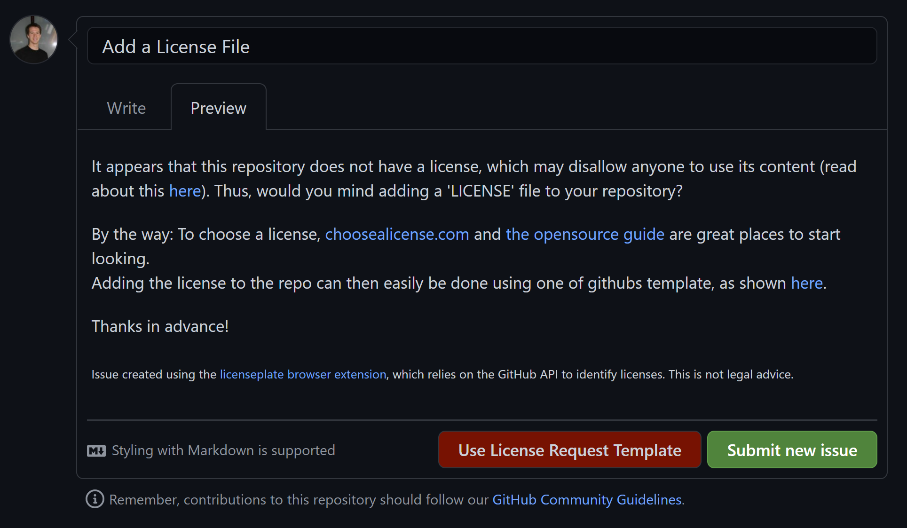

## License Request Issue Template

On repositories where no license file was detected, 
the 'create issue' page will be extended with a button 
**[Use License Request Template]**
to draft an issue asking the repository maintainers 
to add a license file:

<!-- TODO Once images are taken on logged in users, take this image automatically -->

Attention: Clicking the *Use Request Template* button will replace whatever's 
currently in the title and description fields.
